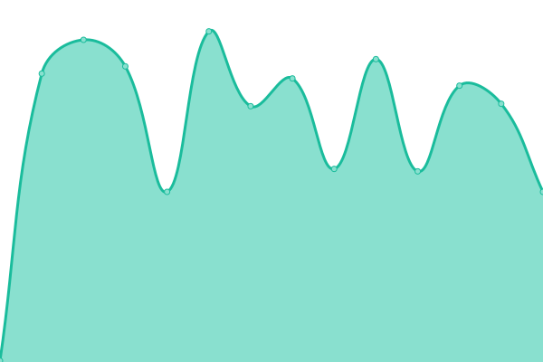

# [📈 Live Status](https://upptime.hentaixy.xyz): <!--live status--> **🟩 All systems operational**

This repository contains the open-source uptime monitor and status page for [Palpitace](https://uptime.hentaixy.xyz), powered by [Upptime](https://github.com/upptime/upptime).

With [Upptime](https://upptime.js.org), you can get your own unlimited and free uptime monitor and status page, powered entirely by a GitHub repository. We use [Issues](https://github.com/Palpitace/upptime/issues) as incident reports, [Actions](https://github.com/Palpitace/upptime/actions) as uptime monitors, and [Pages](https://upptime.hentaixy.xyz) for the status page.

<!--start: status pages-->
<!-- This summary is generated by Upptime (https://github.com/upptime/upptime) -->
<!-- Do not edit this manually, your changes will be overwritten -->
<!-- prettier-ignore -->
| URL | Status | History | Response Time | Uptime |
| --- | ------ | ------- | ------------- | ------ |
|  [Blog](https://blog.hentaixy.xyz) | 🟩 Up | [blog.yml](https://github.com/Palpitace/upptime/commits/HEAD/history/blog.yml) | 

 808ms
     
 | 

<a href="https://upptime.hentaixy.xyz/history/blog">100.00%</a>
    

|  GeekColl | 🟩 Up | [geek-coll.yml](https://github.com/Palpitace/upptime/commits/HEAD/history/geek-coll.yml) | 

 1162ms
     
 | 

<a href="https://upptime.hentaixy.xyz/history/geek-coll">100.00%</a>
    

|  V2Board | 🟩 Up | [v2-board.yml](https://github.com/Palpitace/upptime/commits/HEAD/history/v2-board.yml) | 

 219ms
     
 | 

<a href="https://upptime.hentaixy.xyz/history/v2-board">100.00%</a>
    

<!--end: status pages-->

[**Visit our status website →**](https://demo.upptime.js.org)

## 📄 License

- Powered by: [Upptime](https://github.com/upptime/upptime)
- Code: [MIT](./LICENSE) © [Upptime](https://upptime.js.org)
- Data in the `./history` directory: [Open Database License](https://opendatacommons.org/licenses/odbl/1-0/)
