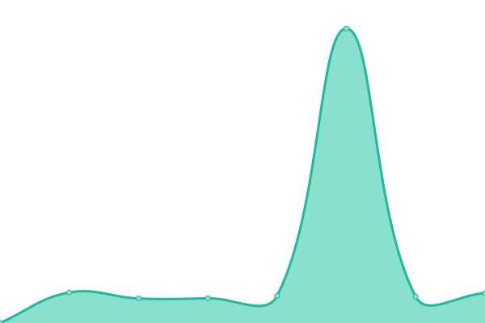

# 

<!--start: description-->

**Upptime** (https://upptime.js.org) is the open-source uptime monitor and status page, powered entirely by GitHub Actions, Issues, and Pages. It's made with 💚 by your friends at [Koj](https://koj.co).

> I find Upptime an incredible clever usage of \[GitHub Actions]. You essentially get a free configurable uptime monitor for whatever you want. – [CSS Tricks](https://css-tricks.com/upptime/)

Upptime is used by [**1,000+**](https://github.com/topics/upptime) people and teams to ensure they know when their endpoints go down.

<!--end: description-->

## [📈 Live Status](https://demo.upptime.js.org): <!--live status--> **🟧 Partial outage**

<!--start: status pages-->
<!-- This summary is generated by Upptime (https://github.com/upptime/upptime) -->
<!-- Do not edit this manually, your changes will be overwritten -->
<!-- prettier-ignore -->
| URL | Status | History | Response Time | Uptime |
| --- | ------ | ------- | ------------- | ------ |
|  [Blog](https://blog.hentaixy.xyz) | 🟩 Up | [blog.yml](https://github.com/Palpitace/upptime/commits/HEAD/history/blog.yml) | 

 788ms
     
 | 

<a href="https://uptime.hentaixy.xyz/history/blog">100.00%</a>
    

|  [GeekColl](https://geekcoll.com) | 🟩 Up | [geek-coll.yml](https://github.com/Palpitace/upptime/commits/HEAD/history/geek-coll.yml) | 

 871ms
     
 | 

<a href="https://uptime.hentaixy.xyz/history/geek-coll">100.00%</a>
    

|  [H5ai-LU](https:/file.hentaixy.top) | 🟩 Up | [h5ai-lu.yml](https://github.com/Palpitace/upptime/commits/HEAD/history/h5ai-lu.yml) | 

 3102ms
     
 | 

<a href="https://uptime.hentaixy.xyz/history/h5ai-lu">100.00%</a>
    

|  [V2Board](https://hentaixy.cloud) | 🟩 Up | [v2-board.yml](https://github.com/Palpitace/upptime/commits/HEAD/history/v2-board.yml) | 

 239ms
     
 | 

<a href="https://uptime.hentaixy.xyz/history/v2-board">100.00%</a>
    

<!--end: status pages-->

[**Visit our status website →**](https://demo.upptime.js.org)

## 📄 License

- Powered by: [Upptime](https://github.com/upptime/upptime)
- Code: [MIT](./LICENSE) © [Upptime](https://upptime.js.org)
- Data in the `./history` directory: [Open Database License](https://opendatacommons.org/licenses/odbl/1-0/)
